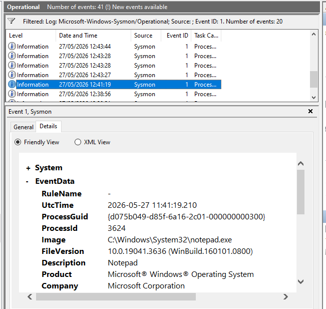
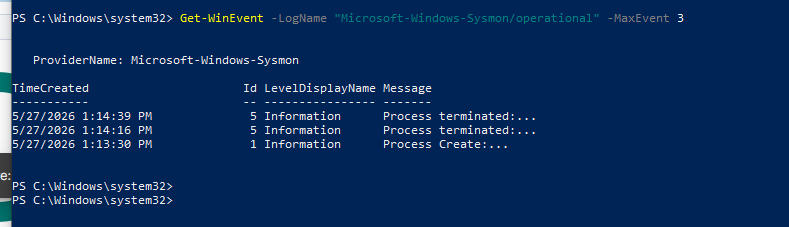
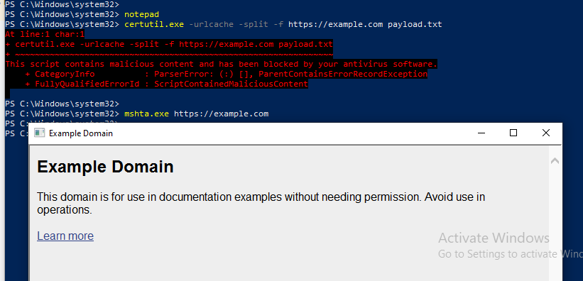
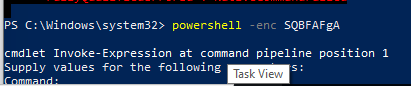
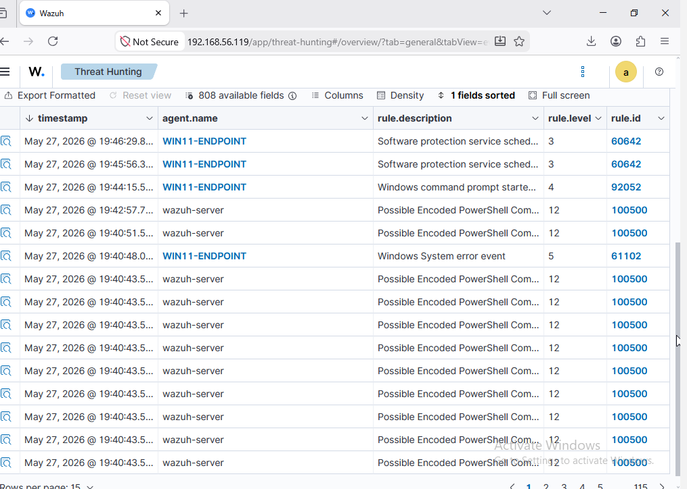
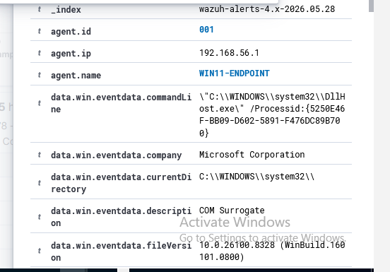
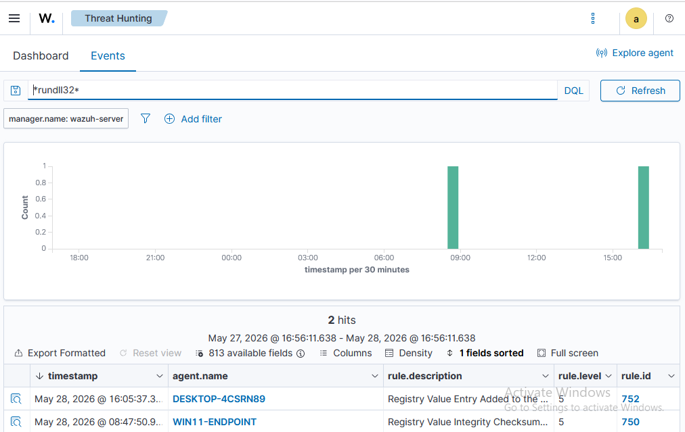

# Wazuh LOLBins Detection Lab

## Project Overview

This project demonstrates the implementation of a Security Operations Center (SOC) detection lab focused on identifying Living-Off-The-Land Binary (LOLBins) abuse using Sysmon and Wazuh.

The objective was to simulate common attacker tradecraft, collect endpoint telemetry, generate detections, and perform threat hunting investigations through the Wazuh platform.

---

## Lab Architecture

```text
                    ┌─────────────────────┐
                    │   Kali Linux VM     │
                    │   Wazuh Server      │
                    │                     │
                    │ • Wazuh Manager     │
                    │ • Wazuh Indexer     │
                    │ • Wazuh Dashboard   │
                    └──────────┬──────────┘
                               │
                               │
                               ▼
                    ┌─────────────────────┐
                    │  Windows 10 VM      │
                    │  WIN10-ENDPOINT     │
                    │                     │
                    │ • Sysmon            │
                    │ • Wazuh Agent       │
                    │ • Event Viewer      │
                    └─────────────────────┘
```

---

## Technologies Used

- Windows 10
- Kali Linux
- Wazuh SIEM
- Wazuh Agent
- Sysmon
- PowerShell
- LOLBins
- VirtualBox
- Event Viewer
- Threat Hunting

---

## Detection Scenarios

The lab focused on detecting:

### Encoded PowerShell Execution

- PowerShell encoded commands
- Suspicious command-line activity
- Process creation monitoring

### LOLBins Abuse

- certutil.exe
- mshta.exe
- rundll32.exe

### Threat Hunting

- Event investigation
- Process telemetry analysis
- Alert correlation
- Sysmon event validation

---

## Detection Workflow

1. Execute LOLBins and PowerShell simulations on Windows 10.
2. Sysmon captures process creation telemetry.
3. Wazuh Agent forwards events to the Wazuh Manager.
4. Wazuh generates detections and alerts.
5. Threat hunting is performed within the Wazuh Dashboard.
6. Alerts are investigated and correlated with endpoint telemetry.

---

## Key Project Screenshots

### Sysmon Event ID 1 Process Creation



### Sysmon Log Verification



### LOLBins Simulation



### Encoded PowerShell Simulation



### Wazuh Detection Alerts



### Suspicious DLL Execution Detection


### Alert Investigation



### Threat Hunting Results



---

## Skills Demonstrated

- Security Monitoring
- SIEM Operations
- Threat Hunting
- Detection Engineering
- Endpoint Telemetry Analysis
- Windows Security Logging
- Sysmon Configuration
- Wazuh Administration
- Incident Investigation
- Alert Correlation

---

## Outcome

Successfully simulated LOLBins and PowerShell-based attack techniques, collected telemetry using Sysmon, generated detections within Wazuh, and performed threat hunting investigations to validate detection coverage and SOC monitoring capabilities.